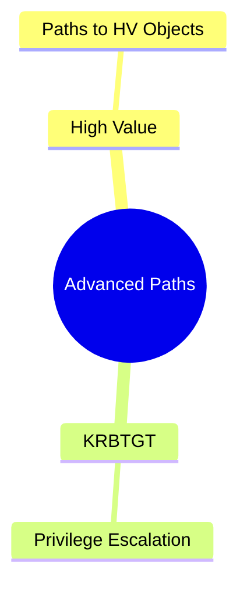
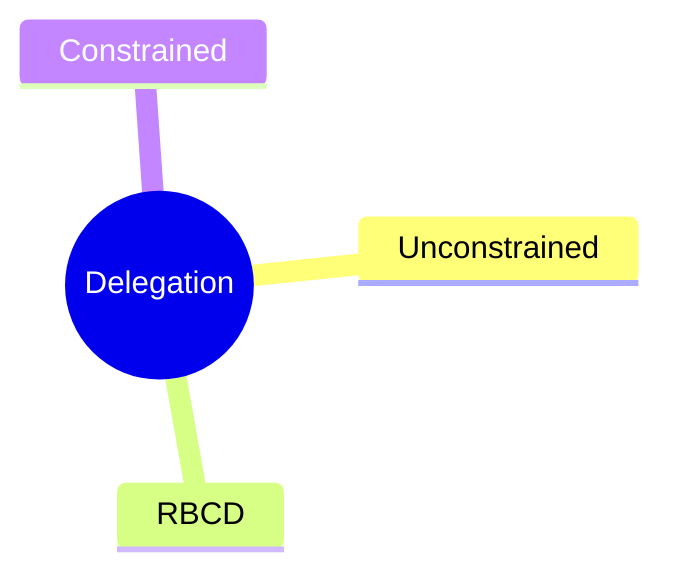
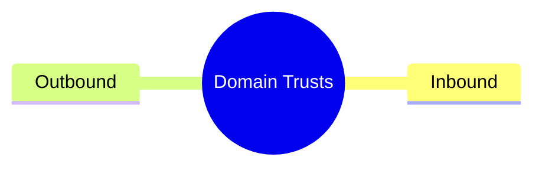
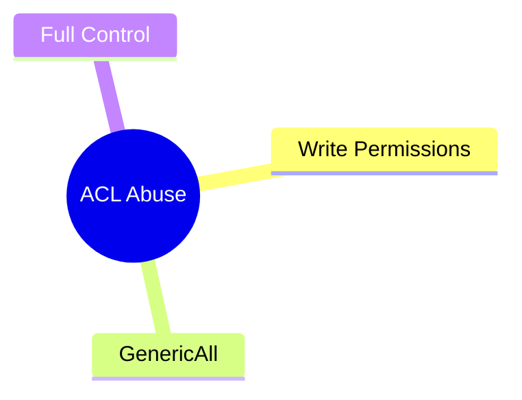

# BloodHound Queries – Advanced Level

## 🚀 Overview

This file contains advanced, high‑value, and attacker‑focused BloodHound queries. Includes **Mermaid mindmaps**, color-coded categories, and complex exploitation chains.

---

## 🛠️ Advanced Attack Path Queries

### **Find All High‑Value Attack Paths**

```
MATCH p = shortestPath((u:User)-[*1..]->(h {highvalue:true}))
RETURN u.name AS User, h.name AS Target, p
```

### **Enumerate Paths to KRBTGT**

```
MATCH p = shortestPath((u:User)-[*1..]->(k:User {name:"KRBTGT@DOMAIN.LOCAL"}))
RETURN p
```



---

## 🧬 Delegation Exploitation Queries

### **Unconstrained Delegation Machines**

```
MATCH (c:Computer)
WHERE c.unconstraineddelegation = true
RETURN c.name
```

### **Resource‑Based Constrained Delegation (RBCD)**

```
MATCH (c:Computer)-[:AllowedToActOnBehalfOf]->(u:User)
RETURN c.name AS VulnerableHost, u.name AS DelegatedAccount
```

### **Constrained Delegation Objects**

```
MATCH (u:User)-[:AllowedToDelegate]->(s:Computer)
RETURN u.name, s.name
```



---

## 🧱 Domain Trust Attacks

```
MATCH (d:Domain)-[:TrustedBy]->(t:Domain)
RETURN d.name, t.name
```

```
MATCH (d:Domain)-[:Trusts]->(t:Domain)
RETURN d.name, t.name
```



---

## 🧑‍💼 Advanced Group & Permission Analysis

### **Users with Write Permissions on GPOs**

```
MATCH (u:User)-[r:WriteGPO]->(g:GPO)
RETURN u.name, g.name, r
```

### **ACL Abuse Targets**

```
MATCH (a:ACL)
WHERE a.rights CONTAINS "Write" OR a.rights CONTAINS "GenericAll" OR a.rights CONTAINS "All"
RETURN a
```



---

## 🏷️ Color Coding

* **Delegation Attacks** → `🟧 Orange`
* **Domain Trust Enumeration** → `🟦 Blue`
* **High Value Targets** → `🟥 Red`
* **ACL Exploitation** → `🟩 Green`

---

## ⚡ Additional Advanced Query Set

### **Detecting Shadow Credentials (KeyCredential Theft)**

```
MATCH (u:User)
WHERE u.keycredentials IS NOT NULL
RETURN u.name, u.keycredentials
```

### **Machines Vulnerable to SMB Signing Off**

```
MATCH (c:Computer)
WHERE c.smbsigning=false
RETURN c.name
```

### **Find All Paths Where User Can Add Members to Privileged Groups**

```
MATCH p=(u:User)-[:AddMember|GenericAll|WriteProperty*1..]->(g:Group)
WHERE g.name CONTAINS "ADMIN"
RETURN u.name, g.name, p
```
