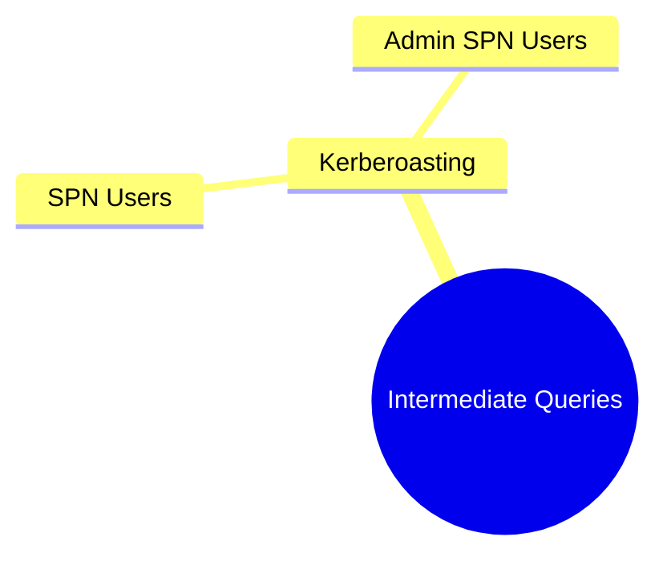
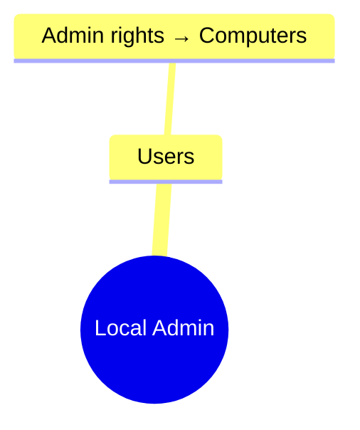

# BloodHound Queries – Intermediate Level

## ⚙️ Overview

This file contains mid‑level queries for identifying potential attack paths and deeper AD relationships. Includes **Mermaid mindmaps** and color‑coded categories.

---

## 🔐 Kerberoasting Queries

```
MATCH (u:User) WHERE u.hasspn = true RETURN u.name
```

```
MATCH (u:User)-[:MemberOf]->(g:Group)
WHERE u.hasspn=true
RETURN u.name, g.name
```

### 🧠 Mindmap



---

## 🛑 AS-REP Roasting

```
MATCH (u:User) WHERE u.donotreqpreauth = true RETURN u.name
```

---

## 🖥️ Local Admin Relationships

```
MATCH (u:User)-[:AdminTo]->(c:Computer)
RETURN u.name, c.name
```

### 🧠 Mindmap



---

## 🏷️ Color Coding

* **Kerberoasting** → `🟥 Red`
* **RDP/DCOM/PSRemoting** → `🟦 Blue`
* **Local Admin Rights** → `🟪 Purple`
